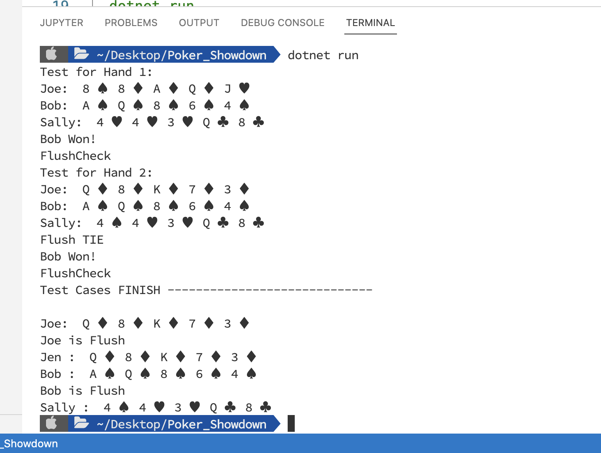

#  Poker Hand Showdown Assessment Solution
C# Library to find Winner in a poker game.

## Link to site
(https://github.com/r97draco/game-challenge/)

## OUT PUT 
<br><br><br>

## Libraries required
1. [NET SDK armx64](https://dotnet.microsoft.com/en-us/download/dotnet/thank-you/sdk-7.0.100-macos-arm64-installer)

## How to start
1. Clone or download the project.
2. Dowload [NET SDK armx64](https://dotnet.microsoft.com/en-us/download/dotnet/thank-you/sdk-7.0.100-macos-arm64-installer).
3. Go to the project and type following in Terminal
<br>```dotnet run```

## Basic Gist of the Algorithm :-
Create Players and assign their cards.<br/>
Check flush. continue if no winner found.<br/>
check three of a kind? continue if no winner found<br/>
check One pain. continue if no winner found at last we check Hishest card and resolve the Ties.<br/>

